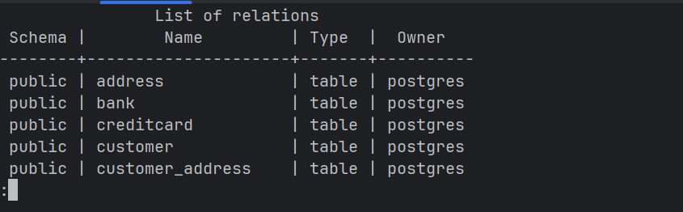
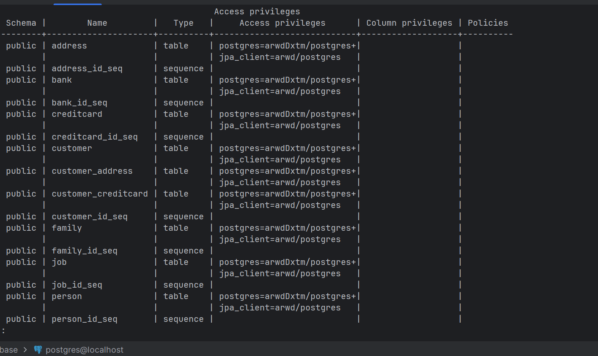
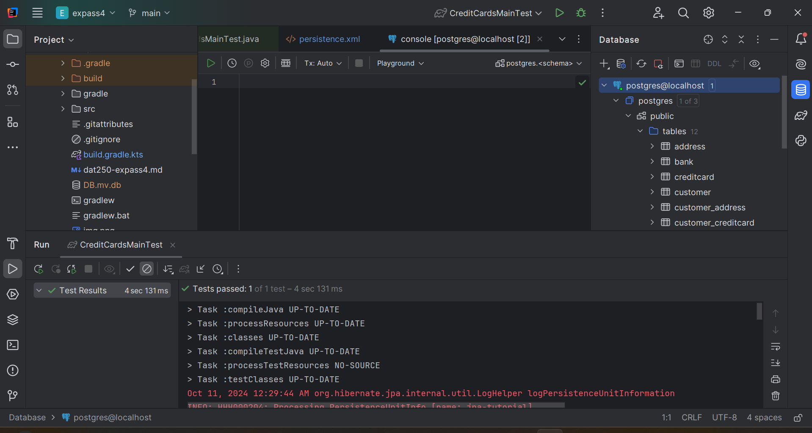
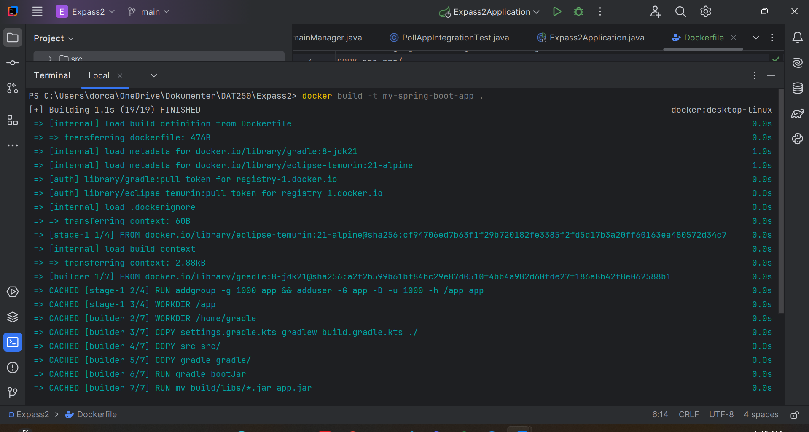

## Expass 7 Report

For this week, the main focus was on docker. For the task, we were supposed to use a docker image of Postgressql to replace the H2 database that we had in Expass 4, and also create our own docker image.

### Part 1: PostgreSQL Image

#### Setup
The setup for this part of the task went relatively smoothly. Since i already had Docker installed, i only needed to pull the PostgreSQL image, which completed without any errors. Running the container also completed without any errors.  From reading the documentation, i learned that the only mandatory environment variable to include with `-e` was `POSTGRES_PASSWORD=somepassword`, which i used. I decided to keep default `postgres` user since i felt it was unnecessary to change it.  For port configuration `-p`, i found out that most PostgreSQL Docker containers run on port `5432` by default. To keep things simple, i decided to use port `5432` for both my host and the container. The command i used was `docker run -p 5432:5432 -e POSTGRES_PASSWORD=somepassword -d --name my-postgres --rm postgres
`.

For the SQL client, i used IntelliJ's built-in Database client since i was already working in IntelliJ. Connecting to the database didn't take very long, i used the previously mentioned port, `localhost`, the default user , and the password. After setting up the connection, i logged in as a superuser using the command `docker exec -it my-postgres-container psql -U postgres`, created the `jpa_client` user, and updated the `persistence.xml` file like as specified from the task.

#### Problems
During this process, i faced several challenges. The first challenge was finding the correct command to bootstrap the database. Although i checked the linked documentation, there was no mention of the `--mount` tag. After some research, i eventually found a command that worked. However, when running the tests, i encountered the error: `ERROR: relation "bank" does not exist`. This puzzled me for a while but i noticed that the tables were missing from the database client, even after refreshing multiple times. I attempted bootstrapping the database again, but still, nothing happened. I ultimately fixed this by manually running the SQL commands to create the tables. After this, i was once again encountered another error: `ERROR: permission denied for table bank`. To solve this, i granted permissions to all tables, but i was given another error: `Cannot invoke "no.hvl.dat250.jpa.tutorial.creditcards.Customer.getName()" because "customer" is null`. This was confusing since the `Customer` table had entries in the database. After thinking it over, i decided to delete the container and remove both `schema.down.sql` and `schema.up.sql` files. I recreated the container, logged into the database, and created the user again. This time, before running the application, i granted the user the necessary permissions on all tables. With these changes, the tests finally ran successfully.

#### Screenshots

### Part 2: Own dockerized application
This part of the task went faster than Part 1. I started by watching some YouTube tutorials on creating Dockerfiles, and after that i looked at the example from Lecture 14. Since the lecture example was quite similar to what we were supposed to do, i decided to follow that approach, making some adjustments where necessary.

For my Dockerfile, i chose to use both `gradle` and `temurin` images since i was already familiar with them.  In addition to the Dockerfile, i created a `.dockerignore` file to exclude unnecessary files from being included in the image. When the Dockefile was finished, i ran the command `docker build -t expass2-app .`, which completed without any errors.

#### Screenshots

#### Conclusion
All in all, this project was very informative and taught me a lot about how docker works and actually how to create your own docker images. This was something completely new for me, and it was exciting to be able to create something like that.

#### Link to Expass 4
[Persistence.xml](https://github.com/dorica5/Expass4/blob/main/src/main/resources/META-INF/persistence.xml)
